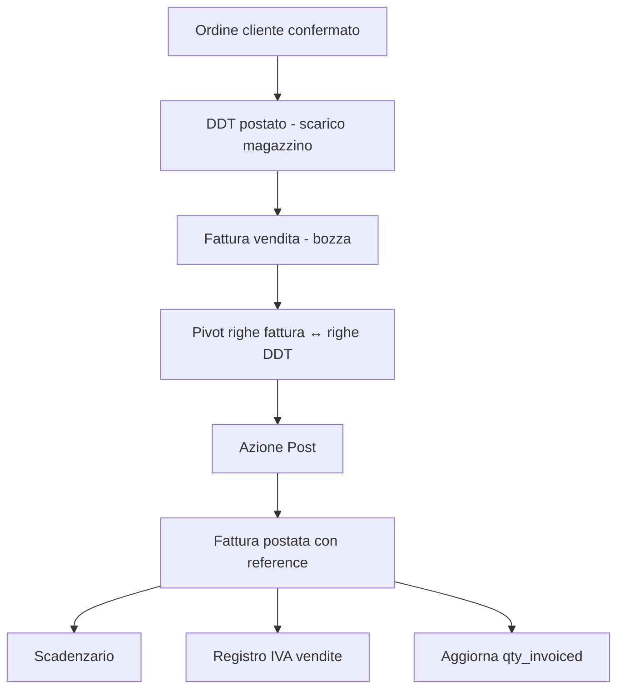
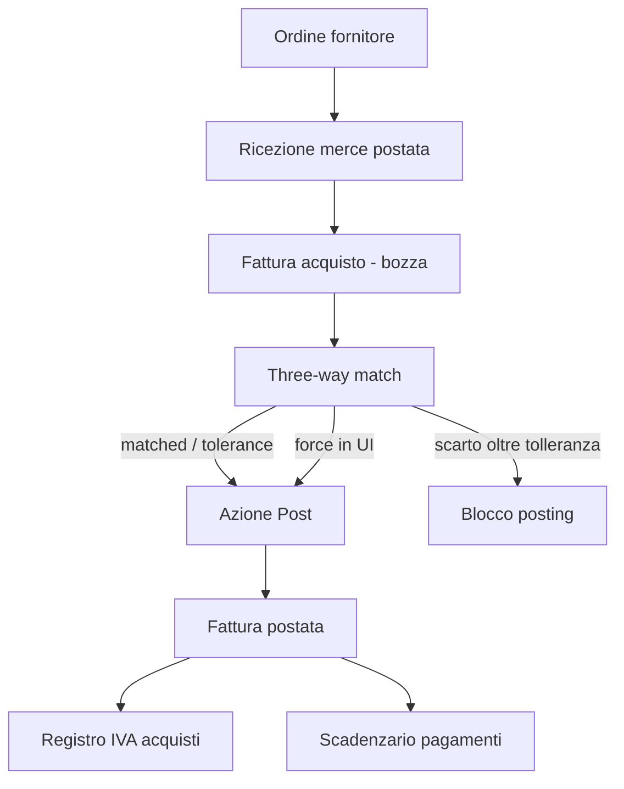
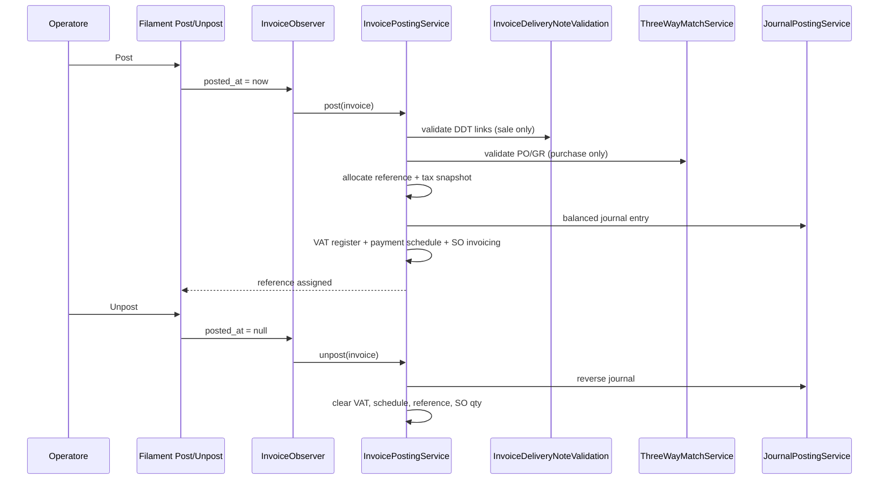

# Guida semplice a un ERP

## 1) Cos'e un ERP (in parole semplici)

Un ERP e un sistema che mette insieme, in un solo flusso, le attivita principali di un'azienda:

- vendite
- acquisti
- magazzino
- contabilita
- controllo e report

L'idea chiave e questa: **i dati si inseriscono una volta sola** e poi alimentano tutti i processi successivi.

Esempio pratico:

1. crei un ordine cliente
2. prepari la consegna
3. scarichi il magazzino
4. emetti fattura
5. registri automaticamente i movimenti contabili

In un ERP ben fatto, questi passaggi sono collegati e coerenti tra loro.

---

## 2) Concetti base da capire subito

### Documento

Un "documento" e un evento aziendale tracciato (es. ordine, DDT, fattura).

- Ha una **testata** (data, cliente/fornitore, stato, note)
- Ha delle **righe** (cosa, quanto, prezzo)

### Stato

Ogni documento passa da stati diversi:

- bozza
- confermato
- parziale
- completato / chiuso

Gli stati servono per sapere "a che punto siamo" e per bloccare modifiche non piu lecite.

### Quantita evase

Nei documenti di vendita/acquisto non basta sapere "ordinato", serve sapere anche:

- quanto e stato consegnato/ricevuto
- quanto e stato fatturato
- quanto resta da evadere

### Registrazione contabile (posting)

"Postare" significa trasformare un fatto operativo in scrittura contabile ufficiale.

- Prima del posting: il documento e operativo
- Dopo il posting: ha effetto economico/contabile

### Tracciabilita

Ogni passaggio deve poter essere ricostruito:

- da quale documento nasce un altro
- quale riga ha generato quale movimento
- quale scrittura contabile e collegata a quale evento operativo

---

## 3) Le entita principali (modello mentale)

Di seguito il modello tipico (semplificato):

- **Company**: azienda/tenant (base di tutto)
- **Party**: soggetto unificato cliente/fornitore (flag `is_customer`/`is_supplier`)
- **Item**: articolo/prodotto/servizio gestito
- **Warehouse**: magazzino
- **StockLevel**: giacenza attuale per articolo+magazzino
- **StockMovement**: movimento di carico/scarico
- **Quotation**: preventivo
- **SalesOrder** + **SalesOrderLine**: ordine cliente
- **DeliveryNote** + **DeliveryNoteLine**: DDT di consegna
- **PurchaseOrder** + **PurchaseOrderLine**: ordine fornitore
- **GoodsReceipt** + **GoodsReceiptLine**: ricezione merce
- **Invoice** + **InvoiceLine**: fattura (anche note credito/debito)
- **JournalEntry** + **JournalEntryLine**: registrazione di partita doppia
- **Account**: conto del piano dei conti
- **DocumentSequence**: numeratori documentali
- **PaymentTerm**: condizioni di pagamento (rate, scadenze, metodo)
- **PaymentScheduleLine**: singola scadenza generata dalla fattura
- **Payment** + **PaymentAllocation**: incasso/pagamento e sua allocazione sulle scadenze
- **VatRegisterEntry**: riga del registro IVA (vendite o acquisti)
- **VatSettlement**: liquidazione IVA periodica

---

## 4) Workflow principali (semplici ma completi)

## 4.1 Workflow vendita (Order to Cash)

1. Preventivo (opzionale)
2. Ordine cliente
3. DDT di consegna
4. Fattura (o nota di credito/debito)
5. Scadenzario automatico
6. Incasso e allocazione pagamenti

Effetti tipici:

- il DDT scarica magazzino e registra il COGS
- il DDT aggiorna lo stato di evasione ordine (`qty_delivered`)
- la fattura genera contabilita ricavi/IVA/clienti e assegna un numero progressivo
- al posting della fattura si generano automaticamente le scadenze (da payment term)
- la fattura viene registrata nei registri IVA (vendite)
- i pagamenti vengono allocati sulle scadenze (open → partial → paid)
- le note di credito invertono i movimenti contabili e generano scadenze negative

## 4.2 Workflow acquisti (Procure to Pay)

1. Ordine fornitore
2. Ricezione merce (GR)
3. Fattura fornitore (con 3-way match)
4. Scadenzario automatico
5. Pagamento e allocazione

Effetti tipici:

- la ricezione carica magazzino e crea cost layer (FIFO/media ponderata)
- la ricezione aggiorna quantita ricevute su ordine
- la fattura acquisto viene validata via 3-way match (ordine/ricezione/fattura)
- la fattura genera contabilita costi/IVA/fornitori e scadenze pagamento
- la fattura viene registrata nel registro IVA acquisti
- i pagamenti vengono allocati sulle scadenze fornitore

## 4.3 Workflow magazzino

- Carico: aumenta giacenza
- Scarico: diminuisce giacenza
- Ogni movimento deve avere origine chiara (documento sorgente)
- Le giacenze sono derivate dai movimenti, non "inventate a mano"

## 4.4 Workflow scadenzario e pagamenti

1. Il posting della fattura genera automaticamente le scadenze basate sul payment term
2. Se non c'e payment term, viene creata una scadenza immediata unica
3. I pagamenti (incassi/esborsi) vengono registrati e allocati sulle scadenze
4. Lo stato della scadenza evolve: aperta → parziale → pagata
5. L'aging report mostra la situazione crediti/debiti per fasce temporali (30/60/90/120+)

## 4.5 Workflow registri IVA e liquidazione

1. Ogni fattura postata viene registrata automaticamente nel registro IVA (vendite o acquisti)
2. Una entry per ogni codice IVA presente in fattura, con numero protocollo progressivo
3. La liquidazione periodica calcola: IVA vendite − IVA acquisti − credito periodo precedente
4. Se il risultato e positivo: debito da versare. Se negativo: credito da riportare
5. La conferma della liquidazione "congela" il periodo e riporta il credito residuo

## 4.6 Workflow note credito/debito

1. Da una fattura postata si puo creare una nota di credito (storna totale o parziale)
2. La NC/ND copia o deriva le righe dalla fattura originale, non dall'ordine
3. Il totale della NC non puo superare l'importo residuo creditabile della fattura originale
4. Al posting, la NC genera movimenti contabili invertiti (debiti↔crediti)
5. Numerazione dedicata (sezionale): SalesCreditNote, PurchaseCreditNote, ecc.

Regola enterprise importante:

- se il cliente rende merce, la nota credito cliente deve usare il prezzo della **fattura vendita originale**
- se rendiamo merce a un fornitore, la nota debito/credito fornitore deve usare il prezzo della **fattura acquisto originale**
- l'ordine cliente/fornitore serve per logistica e tracciabilita, ma non e la fonte naturale del prezzo fiscale
- un prezzo indicato sulla riga reso e solo un override manuale controllato, non il prezzo "normale" del reso

### Resi cliente

Il flusso cliente separa due momenti:

1. **Reso fisico**: `ReturnOrder` approvato/completato, DDT inbound, rientro a magazzino, quantita rese aggiornate.
2. **Rettifica fiscale**: nota credito collegata alla fattura vendita sorgente.

Ogni riga reso cliente deve indicare la riga fattura vendita (`invoice_line_id`) quando si vuole generare la nota credito. Il sistema usa il prezzo della riga fattura vendita; `unit_price` sulla riga reso serve solo se l'operatore deve forzare un prezzo diverso con motivo commerciale.

La nota credito puo essere creata manualmente dopo il completamento del reso. Se l'impostazione aziendale `erp.returns.auto_create_notes_on_complete` e attiva, il completamento del reso crea automaticamente la bozza di nota credito nella stessa transazione. Se la nota non puo essere creata, il completamento fallisce invece di lasciare il reso processato senza rettifica fiscale.

### Resi fornitore

Il flusso fornitore separa ancora di piu logistica e contabilita:

1. **Reso fisico**: `SupplierReturn` approvato/completato, DDT outbound, uscita merce, quantita rese aggiornate su ordine/ricezione.
2. **Rettifica fiscale**: nota debito/credito fornitore collegata alla fattura acquisto sorgente.

La riga ordine fornitore (`purchase_order_line_id`) e la ricezione merce (`goods_receipt_line_id`) servono per sapere cosa e stato reso fisicamente. Per generare la nota fiscale serve anche la riga fattura acquisto (`invoice_line_id`). Se manca, il sistema deve bloccare la generazione automatica/manuale della nota fiscale: il reso logistico puo esistere, ma la rettifica contabile deve aspettare la fattura.

La nota debito/credito fornitore puo essere creata manualmente dopo il completamento del reso. Se `erp.returns.auto_create_notes_on_complete` e attiva, il completamento del reso fornitore crea automaticamente la bozza di nota debito usando la fattura acquisto sorgente.

## 4.7 Workflow posting fattura (vendita e acquisto)

Questa sezione descrive il ciclo di vita operativo-contabile della fattura nel modulo ERP: dalla bozza al posting, con le azioni UI e i controlli automatici.

### Stati della fattura

| Stato | Cosa significa | Cosa vedi in interfaccia |
| ----- | -------------- | ------------------------ |
| **Bozza (draft)** | Documento commerciale salvato ma non contabilizzato | Nessun `reference` fiscale, nessuna scrittura contabile |
| **Postata (posted)** | Registrazione ufficiale completata | `reference` assegnato, journal collegato, scadenzario e registro IVA aggiornati |

La fattura **non** va postata modificando manualmente un campo data: si usano i pulsanti **Post** / **Unpost** (pagina modifica fattura e lista fatture in Filament).

### Cosa succede quando premi «Post»

Ordine logico (tutto in una transazione database):

1. **Validazioni pre-posting**
   - almeno una riga fattura
   - (vendita) eventuali collegamenti a righe DDT: DDT gia postato, quantita coerenti, non si supera il consegnato gia fatturato
   - (acquisto) three-way match su ogni riga collegata a ordine fornitore e/o ricezione merce
2. **Numerazione fiscale** — `reference` assegnato da `DocumentNumberAllocator` (stream separato vendita/acquisto/NC/ND; senza «buchi» ammessi sui documenti fiscali)
3. **Snapshot IVA sulle righe** — codice, aliquota ed etichetta congelati sulla riga
4. **Scrittura contabile** — `JournalEntry` bilanciata (ricavi/IVA/clienti o costi/IVA/fornitori)
5. **Registro IVA** — una riga per codice IVA con protocollo progressivo
6. **Scadenzario** — righe scadenza da `PaymentTerm` (o scadenza unica immediata se assente)
7. **Evasione ordine** — (solo vendita con riga ordine collegata) aggiornamento `qty_invoiced` sull'ordine cliente

### Cosa succede quando premi «Unpost»

1. Storno della scrittura contabile (journal di rettifica)
2. Rimozione voci registro IVA
3. Rimozione scadenze **solo se** non ci sono gia pagamenti allocati
4. Rollback quantita fatturate sull'ordine cliente (vendita)
5. Azzeramento `reference` e sblocco modifica righe (in bozza)

### Workflow fattura vendita con collegamento DDT (opzionale)

Il collegamento fattura ↔ DDT e **opzionale**: puoi fatturare senza DDT (es. servizi) o collegare una o piu righe DDT per tracciare cosa stai fatturando del consegnato.



**Regole principali (vendita + DDT):**

- il DDT deve essere **gia postato** prima di poterlo collegare in fattura
- la somma delle quantita collegate al DDT su una riga fattura non puo superare la quantita della riga fattura
- la quantita totale fatturata su una riga DDT (tutte le fatture postate) non puo superare la quantita consegnata su quella riga DDT
- se la riga fattura ha anche `sales_order_line_id`, deve essere coerente con la riga ordine del DDT collegato

In Filament, su ogni riga fattura vendita puoi aggiungere uno o piu **Delivery note lines** (riga DDT + quantita).

### Workflow fattura acquisto con three-way match

Per le fatture fornitore (`direction = purchase`), al posting ogni riga viene confrontata con:

- la riga **ordine fornitore** (`purchase_order_line_id`), se presente — prezzo e quantita
- la riga **ricezione merce** (`goods_receipt_line_id`), se presente — quantita



**Esiti del match (salvati su ogni riga fattura):**

| `match_status` | Significato |
| -------------- | ----------- |
| `matched` | Prezzo e quantita allineati a PO/GR entro tolleranza |
| `tolerance` | Piccole differenze entro la percentuale configurata |
| `forced` | Differenze oltre tolleranza ma posting forzato dall'operatore |
| `unmatched` | Nessun collegamento PO/GR sulla riga (consentito, ma senza confronto) |

**Tolleranze** (per company, in `companies.settings` JSON, default 0%):

- `erp.three_way_match.price_tolerance_percent` — scarto prezzo massimo %
- `erp.three_way_match.qty_tolerance_percent` — scarto quantita massimo %

Esempio JSON sulla company:

```json
{
  "erp": {
    "three_way_match": {
      "price_tolerance_percent": 2,
      "qty_tolerance_percent": 1
    }
  }
}
```

Se il match fallisce e non forzi: il posting viene bloccato con errore di validazione.

In Filament, all'azione **Post** su fatture acquisto compare la checkbox **Force three-way match** per autorizzare lo scarto controllato (stato `forced` + dettaglio in `match_discrepancy` JSON).

### Interfaccia Filament (riepilogo operatore)

| Azione | Dove | Quando visibile |
| ------ | ---- | ----------------- |
| **Post** | Modifica fattura / lista | Fattura in bozza (`journal_entry_id` assente) |
| **Unpost** | Modifica fattura / lista | Fattura gia postata |
| **Create Credit Note** | Modifica fattura | Fattura vendita postata di tipo `invoice` |

Dopo il posting: righe fattura e campi strutturali sono in sola lettura; restano modificabili solo campi di testata non critici (es. note) secondo le regole del form.

### Diagramma unificato posting / unpost



---

## 4.8 Workflow report finanziari

1. **Bilancio di verifica**: saldi dare/avere per ogni conto, a una data scelta
2. **Stato patrimoniale**: attivita = passivita + patrimonio netto + utile netto
3. **Conto economico**: ricavi − costi per un periodo scelto
4. Tutti i report sono derivati in tempo reale dai journal postati (nessuna tabella separata)
5. Le pagine Filament dei tre report permettono export CSV dei dati visualizzati

## 4.9 Workflow dashboard operative

1. **Sales Pipeline**: mostra opportunita per stato, valore pipeline, valore vinto nel periodo e conteggio perse
2. Il filtro `won_from` / `won_to` limita i KPI del vinto al periodo scelto senza cancellare la pipeline aperta
3. **Stock Valuation**: mostra quantita, costo medio e valore per articolo/magazzino
4. Il filtro magazzino limita righe e totali al magazzino selezionato
5. Entrambe le pagine permettono export CSV dei dati visualizzati

---

## 5) Relazioni fondamentali tra entita

## 5.1 Relazioni documento -> documento

- Un `SalesOrder` puo avere piu `DeliveryNote`
- Un `DeliveryNote` puo riferire righe di `SalesOrderLine`
- Un `PurchaseOrder` puo avere piu `GoodsReceipt`

Questo crea la catena di processo.

## 5.2 Relazioni documento -> magazzino

- `DeliveryNoteLine` -> crea `StockMovement` OUT
- `GoodsReceiptLine` -> crea `StockMovement` IN

Le righe operative sono il ponte verso il magazzino.

## 5.3 Relazioni documento -> contabilita

- un documento operativo puo generare `JournalEntry`
- `JournalEntry` puo mantenere un riferimento al documento sorgente (`reference_type`, `reference_id`)

Questo permette audit e riconciliazione.

---

## 6) Regole ERP importanti (business rules)

### Coerenza azienda (company)

Tutto deve appartenere alla stessa company:

- cliente
- articoli
- magazzini
- documenti
- registrazioni contabili

### No quantità impossibili

- non puoi consegnare piu di quanto ordinato
- non puoi scaricare piu stock di quello disponibile

### Idempotenza

Se un documento gia postato viene salvato di nuovo, non deve duplicare i movimenti.

### Immutabilita contabile (dopo posting)

Una registrazione contabile postata non dovrebbe essere modificata liberamente:

- si rettifica con storni/rettifiche
- non con edit silenziosi

### Numerazione documentale

Ogni tipo documento ha il suo numeratore.

- sequenziale
- univoco
- con regole sui "buchi" (gap allowed / not allowed) in base al tipo

---

## 7) Differenza tra operativo e contabile

### Operativo

Risponde a: "cosa sta succedendo nel lavoro quotidiano?"

- ordini
- consegne
- ricezioni
- progressi delle quantita

### Contabile

Risponde a: "che impatto economico e finanziario ha?"

- ricavi/costi
- debiti/crediti
- IVA
- bilancio

Un ERP maturo collega bene i due livelli.

---

## 8) Perche servono i riferimenti tra oggetti

Senza riferimenti chiari, dopo qualche mese non capisci piu:

- da dove nasce un valore in bilancio
- quale documento ha mosso il magazzino
- perche un ordine risulta "parziale"

Con riferimenti e regole:

- fai audit
- fai troubleshooting
- fai report affidabili

---

## 9) KPI e controlli minimi da monitorare

- ordini aperti vs evasi
- consegne in ritardo
- valore magazzino
- rotazione magazzino
- margine lordo (ricavi - costo del venduto)
- fatture emesse/non pagate (aging AR 30/60/90/120+)
- fatture fornitore da pagare (aging AP 30/60/90/120+)
- bilancio di verifica (quadratura dare/avere)
- liquidazione IVA periodica (debito/credito)
- scadenze aperte per fascia temporale

---

## 10) Errori comuni da evitare in un ERP

- aggiornare numeri "a mano" senza workflow
- saltare gli stati documento
- permettere edit su documenti gia contabilizzati senza regole
- non tracciare la fonte dei movimenti
- duplicare processi (stesso fatto registrato due volte)

---

## 11) Come leggere il sistema ERP di questo progetto

Approccio consigliato:

1. capisci la catena documento -> documento
2. guarda dove nasce il movimento di magazzino
3. guarda dove nasce la scrittura contabile
4. verifica gli stati e i lock
5. verifica i test: raccontano il comportamento atteso

---

## 12) Mini glossario veloce

- **DDT**: documento di trasporto/consegna
- **GR (Goods Receipt)**: ricezione merce da fornitore
- **COGS**: costo del venduto
- **Posting**: registrazione ufficiale in contabilita
- **Partita doppia**: ogni scrittura ha dare/avere bilanciati
- **3-way match**: confronto ordine, ricezione, fattura fornitore al posting
- **Post / Unpost**: azioni Filament per contabilizzare o stornare una fattura (non usare posted_at a mano)
- **Force three-way match**: override controllato quando prezzo/qty acquisto superano la tolleranza
- **Party**: soggetto commerciale unificato (cliente e/o fornitore)
- **Payment Term**: condizione di pagamento (rate, scadenze, metodo)
- **Scadenzario**: elenco scadenze generate dalla fattura con stato pagamento
- **Aging**: analisi crediti/debiti scaduti per fasce temporali
- **NC/ND**: nota di credito / nota di debito
- **Registro IVA**: registro obbligatorio vendite/acquisti con protocollo progressivo
- **Liquidazione IVA**: calcolo periodico IVA debito − IVA credito
- **Bilancio di verifica (Trial Balance)**: saldi dare/avere di tutti i conti
- **Stato patrimoniale (Balance Sheet)**: attivita, passivita, patrimonio netto
- **Conto economico (Income Statement)**: ricavi meno costi di un periodo

---

## 13) Conclusione pratica

Un ERP non e solo "fare documenti": e garantire che tutto resti coerente nel tempo tra:

- processo operativo
- magazzino
- contabile
- controllo gestionale

---

## 14) Stato attuale del modulo in questo progetto

### Gia implementato

- aziende, piano dei conti, giornali, periodi fiscali, numeratori
- preventivi, ordini cliente, DDT, fatture vendita/acquisto
- posting/unposting fatture tramite azioni Filament
- magazzino con movimenti, livelli stock, cost layers FIFO/media ponderata
- COGS su DDT outbound
- ciclo acquisti con ordine, ricezione merce e three-way match
- scadenzario da condizioni di pagamento, pagamenti e allocazioni
- registri IVA e liquidazione IVA
- distinte pagamenti fornitori ed export bancario SEPA pain.001
- report contabili principali: bilancio di verifica, stato patrimoniale, conto economico
- CRM commerciale: lead, opportunita, preventivi
- price list, regole prezzo per cliente/fornitore e resolver prezzi
- resi cliente e fornitore con DDT e aggiornamento quantita rese
- note credito/debito manuali collegate ai resi
- contratto corretto per i prezzi delle note da reso:
  - cliente: prezzo da riga fattura vendita
  - fornitore: prezzo da riga fattura acquisto
- permessi e azioni dominio principali: post, unpost, force post, unlock quotation, reset document sequence
- e-invoice stub con invio/refresh locale deterministico
- riconciliazione bancaria v1: import CSV/CAMT.053/MT940 minimale, suggerimenti, match manuale, match con differenze e scritture contabili per commissioni/arrotondamenti

### Prossima fase: FatturaPA / SDI

Oggi il modulo ERP ha gia il flusso base per tracciare un invio e-invoice, ma l'invio e ancora locale/stub: serve per testare il workflow, non per mandare davvero una fattura al Sistema di Interscambio.

La fase 2C serve a portare questo flusso verso l'uso reale italiano:

- raccogliere sui dati azienda, cliente e fattura i campi fiscali necessari per FatturaPA
- preparare il mapping corretto tra anagrafiche ERP e tracciato SDI
- generare XML FatturaPA
- validare l'XML con gli schemi XSD
- collegare un provider reale, partendo da un adapter tipo Aruba
- proteggere le azioni fiscali piu delicate con permessi dedicati

### Ancora aperto

- FatturaPA / SDI completa: oggi c'e lo stub, non ancora XML valido, XSD, invio reale SDI/Aruba o conservazione.
- Dati anagrafici FatturaPA: alcuni campi fiscali necessari su azienda, cliente/fornitore e fattura devono ancora essere aggiunti.
- Pagamenti fornitori: oggi si genera il file SEPA pain.001, ma non si invia direttamente alla banca; CBI, Ri.Ba e SDD non sono pronti.
- Estratti conto: import CSV, CAMT.053 e MT940 minimale; non c'e sincronizzazione automatica con la banca.
- API esterne e azioni dominio HTTP: le azioni esistono in Filament, ma l'esposizione API governata e una fase successiva.
- Resi gia processati: si possono annullare resi draft/approved, ma manca ancora il reverse sicuro di un reso gia completato.
- Report: disponibili a video e CSV; non ci sono ancora PDF, schedulazioni o archivi immutabili del report.
- Multi-valuta: la struttura e predisposta, ma cambi reali, rivalutazioni e differenze cambio non sono ancora implementati.
- Dimensioni analitiche: non ci sono ancora centri di costo/profitto completi sulle righe contabili.
- DDT/bolle: restano documenti di quantita e collegamento; non devono contenere prezzi. I prezzi di note credito/debito arrivano dalle fatture.
- MES, Gantt, calendario ICS, API mobile, ETL legacy e Tricount avanzato non fanno parte della fase ERP corrente.
