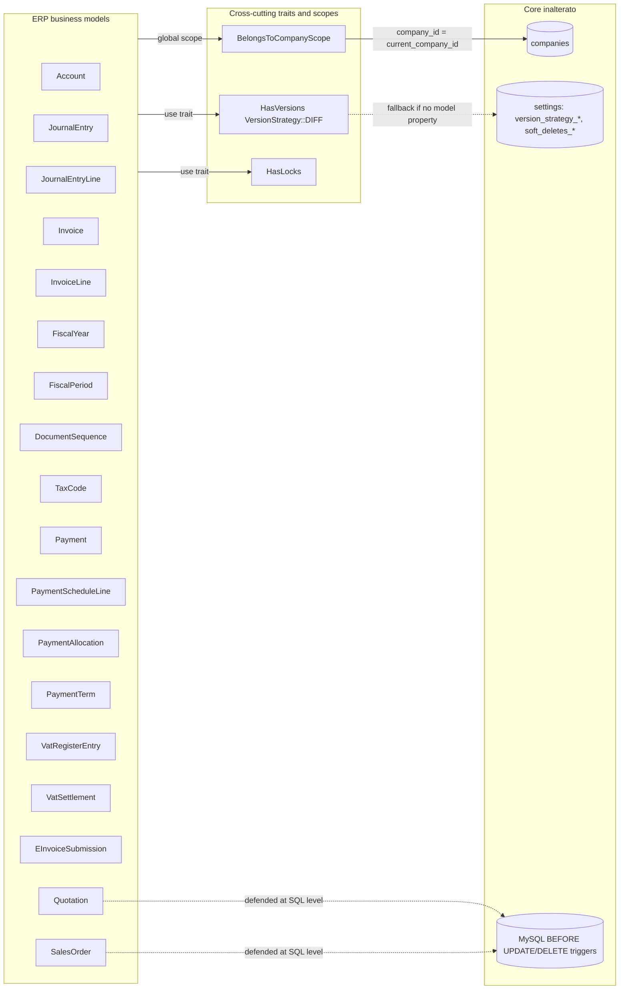
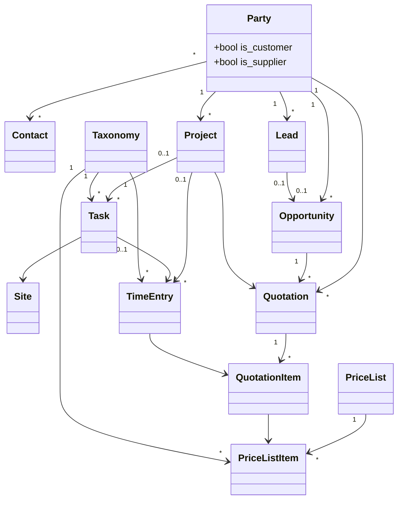
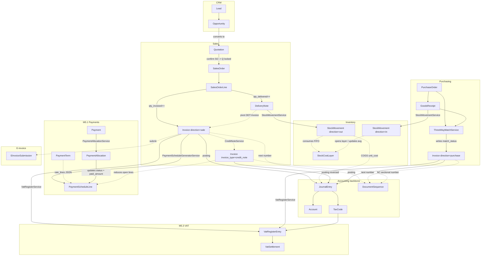
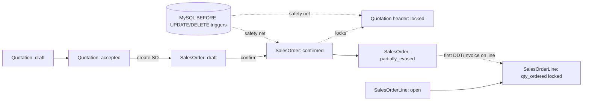
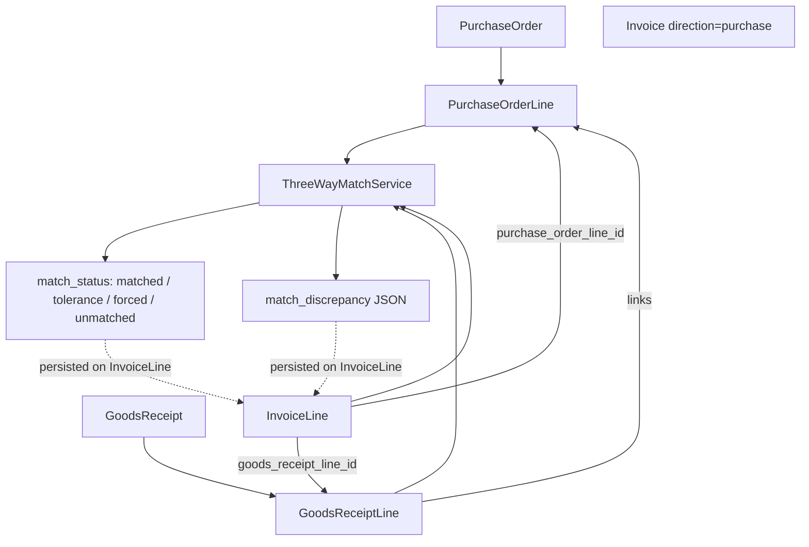
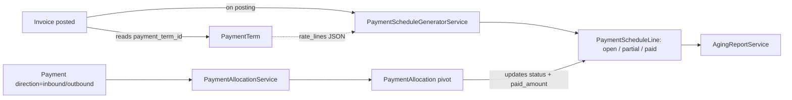
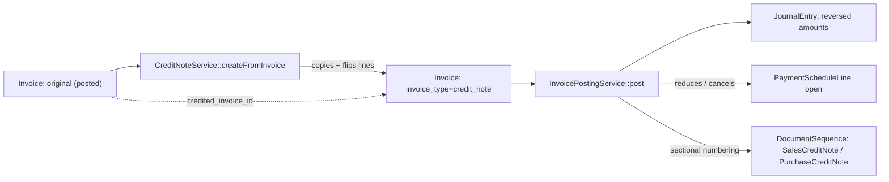
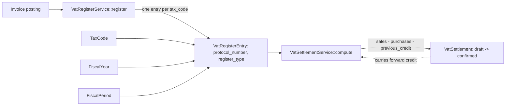
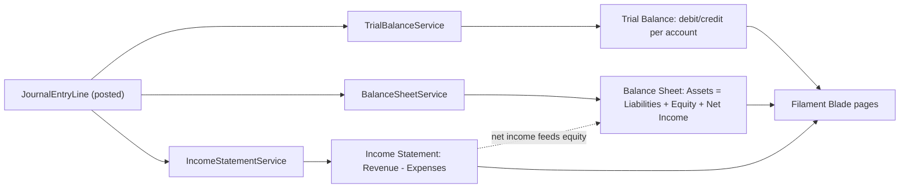

# ERP module — commercial, logistics, accounting, and fiscal domain

## Purpose

`ERP` delivers operational business workflows in Laraplate: CRM, sales, purchasing, inventory, accounting, tax management, payments, and fiscal governance for Italian compliance.

It models the transactional backbone where business documents, stock movements, accounting entries, and fiscal records must remain consistent and auditable.

## Module metadata

- **Namespace:** `Modules\ERP`
- **Composer package:** `swolley/laraplate-erp`
- **Config key:** `erp`
- **Directory:** `Modules/ERP/`
- **Dependencies:** `Core` module (users, permissions, locks, settings, versioning)

## Architecture principles

- All business transitions pass through the **service layer** — never direct model updates from controllers.
- **Observers** react to model events for side effects (e.g., SO lock on quotation acceptance).
- **Posting services** are the only path to create/reverse journal entries.
- Currency conversion is pluggable via `CurrencyConverter` (default: no-op with fx_rate=1.0).
- Multi-tenancy via `BelongsToCompany` trait with automatic global scope.
- Dual-currency on every transactional amount: `amount_doc`/`currency_doc` + `amount_local`/`fx_rate`.
- Versioning: `HasVersions` trait with `VersionStrategy::DIFF` enforced on accounting models.

### Cross-cutting concerns diagram

Every transactional ERP model is automatically scoped by `BelongsToCompanyScope` (filters by `current_company_id`), versioned via `HasVersions` (the model property `protected VersionStrategy $versionStrategy = VersionStrategy::DIFF` takes priority over the `settings` table fallback), and may use `HasLocks` for application-level lock policies. Quotations and Sales Orders also have MySQL `BEFORE UPDATE`/`BEFORE DELETE` triggers as a SQL-level safety net.

## Core functional areas

### Master data

| Entity    | Model       | Table        | Key aspects                                                      |
| --------- | ----------- | ------------ | ---------------------------------------------------------------- |
| Company   | `Company`   | `companies`  | Tenant root, functional_currency, locale                         |
| Party     | `Party`     | `parties`    | Unified customer/supplier with `is_customer`/`is_supplier` flags |
| Contact   | `Contact`   | `contacts`   | M:N with Party via `contactables` pivot                          |
| Site      | `Site`      | `sites`      | Physical location linked to `places`                             |
| Item      | `Item`      | `items`      | Product/service with SKU and costing_method                      |
| Warehouse | `Warehouse` | `warehouses` | Storage location per company                                     |

#### Commercial domain entity-relationship diagram

`Party` is the unified customer/supplier root, linked M:N to `Contact` via the `contactables` pivot. The CRM funnel is `Lead -> Opportunity -> Quotation`; an `Opportunity` becomes `won` automatically when its `Quotation` transitions to `accepted` (see `OpportunityLifecycleService` + `QuotationObserver`). `Project` aggregates work and may bind to a `Quotation`. `Task` and `TimeEntry` are typed by `Taxonomy` (Core abstract model); `TimeEntry` may reference a `QuotationItem` for billing-side valorization.

### CRM

| Entity           | Service                       | Purpose                                    |
| ---------------- | ----------------------------- | ------------------------------------------ |
| Lead             | —                             | Early-stage prospect with status lifecycle |
| Opportunity      | `OpportunityLifecycleService` | Qualified deal with pipeline stages        |
| OpportunityStage | —                             | Taxonomy-based CRM pipeline configuration  |

- `QuotationObserver` auto-marks opportunity as `won` when quotation status = accepted.

### Order-to-Cash

**Flow:** Quotation → Sales Order → Delivery Note → Invoice → Payment

| Step          | Model(s)                           | Service(s)                                                       | Key behaviors                                                                    |
| ------------- | ---------------------------------- | ---------------------------------------------------------------- | -------------------------------------------------------------------------------- |
| Quotation     | `Quotation`, `QuotationItem`       | —                                                                | HasLocks, HasValidity, lock on SO confirmation                                   |
| Sales Order   | `SalesOrder`, `SalesOrderLine`     | `SalesOrderEvasionService`, `SalesOrderAmendmentService`         | Lock-chain, qty tracking (ordered/delivered/invoiced), amendment from confirmed  |
| Delivery Note | `DeliveryNote`, `DeliveryNoteLine` | `DeliveryNoteInventoryService`, `DeliveryNoteCogsJournalService` | Stock posting (outbound), COGS journal, full rollback on unpost                  |
| Invoice       | `Invoice`, `InvoiceLine`           | `InvoicePostingService`, `InvoiceCompactionService`              | Journal posting, tax snapshot, document numbering at posting, pivot to DDT lines |
| Payment       | `Payment`, `PaymentAllocation`     | `PaymentAllocationService`                                       | Allocate to schedule lines, status tracking                                      |

#### End-to-end document flow to Journal

The full document chain from CRM to accounting entries: a `Quotation` confirmation creates a `SalesOrder` (which locks the Quotation header). Each `DeliveryNote` posting calls `StockMovementService` to consume FIFO/avg layers and `DeliveryNoteCogsJournalService` to post a COGS `JournalEntry`. The `Invoice` posting allocates a `DocumentSequence` number (gap_allowed=false), creates the balanced `JournalEntry`, generates `PaymentScheduleLine` rows from `PaymentTerm`, and registers each line in the `VatRegisterEntry` table. Credit notes (`invoice_type=credit_note`) reuse the same posting service with sign-flipped amounts and reduce open schedule lines. The purchase cycle mirrors sales but adds `ThreeWayMatchService` validation across PO, GR, and Invoice lines.

#### Lock-chain on Sales Order

The lock chain protects in-progress documents from accidental modification: when a `SalesOrder` is `confirmed`, its source `Quotation` header is locked via `HasLocks`. As soon as the first `DeliveryNote` or `Invoice` is created against a line, that line's `qty_ordered` is locked. MySQL `BEFORE UPDATE`/`BEFORE DELETE` triggers on `quotations` and `sales_orders` provide a SQL-level safety net: even a buggy service that bypassed observers would be rejected at the DB level.

### Procure-to-Pay

**Flow:** Purchase Order → Goods Receipt → Purchase Invoice → Payment

| Step           | Model(s)                             | Service(s)             | Key behaviors                                                         |
| -------------- | ------------------------------------ | ---------------------- | --------------------------------------------------------------------- |
| Purchase Order | `PurchaseOrder`, `PurchaseOrderLine` | —                      | Document numbering, qty tracking                                      |
| Goods Receipt  | `GoodsReceipt`, `GoodsReceiptLine`   | —                      | Stock inbound posting                                                 |
| 3-Way Match    | —                                    | `ThreeWayMatchService` | Validates PO/GR/Invoice line consistency with configurable tolerances |

#### 3-Way match flow

`ThreeWayMatchService::validate()` cross-checks `PurchaseOrderLine`, `GoodsReceiptLine` and `InvoiceLine` qty/price triplets at purchase invoice posting. Each `InvoiceLine` carries `purchase_order_line_id` and `goods_receipt_line_id` plus `match_status` (`MatchStatus` enum: `matched`, `tolerance`, `forced`, `unmatched`) and a `match_discrepancy` JSON column. Tolerances are configurable (default 0%); exceeding them throws `ValidationException` unless `force=true` is explicitly passed. The matched status is persisted on the line for audit.

### Inventory

- `StockMovement` records every stock change with document reference.
- `stock_cost_layers` for FIFO and weighted-average costing.
- `StockMovementService` handles inbound/outbound with cost layer management.
- `StockLevel` derived from movements (not manually set).

### Accounting

| Service                      | Purpose                                                             |
| ---------------------------- | ------------------------------------------------------------------- |
| `JournalPostingService`      | Post and reverse balanced journal entries (immutable after posting) |
| `ChartOfAccountsInstaller`   | Auto-install Italian PDC on first use                               |
| `DocumentNumberAllocator`    | Pessimistic-lock numbering per company/type/year                    |
| `FiscalPeriodCloser`         | Close/reopen fiscal periods with audit                              |
| `TaxLineCalculator`          | Resolve active tax code at date, compute amounts                    |
| `TaxCodeSupersessionService` | Handle tax code versioning (new code replaces old)                  |

### Payment Schedule & Receivables

| Service                           | Purpose                                                                                      |
| --------------------------------- | -------------------------------------------------------------------------------------------- |
| `PaymentScheduleGeneratorService` | Auto-generates schedule lines at invoice posting (from PaymentTerm or single immediate line) |
| `PaymentAllocationService`        | Allocates payments to schedule lines with status updates (open→partial→paid)                 |
| `AgingReportService`              | AR/AP aging by 30/60/90/120+ day buckets grouped by party                                    |

- `PaymentTerm` defines installment rules via `rate_lines` JSON: `[{days, percent, payment_method}]`.
- Schedule lines are auto-created on invoice posting and removed on unpost (if no allocations exist).

#### Payment lifecycle

When `InvoicePostingService::post()` runs, it reads the invoice's `payment_term_id` and delegates to `PaymentScheduleGeneratorService`, which expands the term's `rate_lines` JSON into one `PaymentScheduleLine` per installment (initial status `open`). Each `Payment` (direction `inbound` or `outbound`) is allocated to one or more schedule lines through the `PaymentAllocation` pivot via `PaymentAllocationService::allocate()`; allocations update `paid_amount_doc` and the line status (`open -> partial -> paid`). `AgingReportService` aggregates open lines by party into 30/60/90/120+ day buckets.

### Credit & Debit Notes

| Service             | Purpose                                                                                        |
| ------------------- | ---------------------------------------------------------------------------------------------- |
| `CreditNoteService` | Creates credit note from posted invoice, copies lines, validates total doesn't exceed original |

- `InvoiceType` enum: `invoice`, `credit_note`, `debit_note`.
- Credit notes use inverted journal entries (debits↔credits flipped).
- Separate document numbering: `SalesCreditNote`, `PurchaseCreditNote`, `SalesDebitNote`, `PurchaseDebitNote`.
- CN total cannot exceed remaining creditable amount of original invoice.

#### Credit note flow

`CreditNoteService::createFromInvoice()` clones the original `Invoice` into a new one with `invoice_type=credit_note` and `credited_invoice_id` referencing the source. Lines are duplicated and amounts validated to never exceed the residual credit-able amount. On posting, `InvoicePostingService::post()` produces a sign-flipped `JournalEntry` (debits and credits swapped), allocates a number from a dedicated sectional (`DocumentType::SalesCreditNote` / `PurchaseCreditNote`), and reduces or cancels open `PaymentScheduleLine` entries linked to the original invoice.

### VAT Registers & Settlement (Italian Compliance)

| Service                | Purpose                                                                                                  |
| ---------------------- | -------------------------------------------------------------------------------------------------------- |
| `VatRegisterService`   | Auto-registers invoices in VAT register at posting (one entry per tax code, progressive protocol number) |
| `VatSettlementService` | Computes periodic VAT settlement (sales VAT − purchase VAT − previous credit)                            |

- `VatRegisterEntry`: protocol_number is sequential per company/register_type/fiscal_year.
- `VatSettlement`: draft → confirmed lifecycle with carry-forward of credit.
- Credit notes create negative register entries.

#### VAT registers and settlement flow

At invoice posting, `VatRegisterService::register()` writes one `VatRegisterEntry` per `tax_code` on the invoice, assigning a `protocol_number` progressive per `(company_id, register_type, fiscal_year)`. The entries are scoped by `register_type` (`sales` / `purchases`). At period close, `VatSettlementService::compute()` aggregates the period's entries: `vat_sales - vat_purchases - previous_credit = settlement_amount`. The resulting `VatSettlement` (status `draft -> confirmed`) carries any negative balance forward as `previous_credit` to the next period.

### Financial Statements

| Service                  | Purpose                                          |
| ------------------------ | ------------------------------------------------ |
| `TrialBalanceService`    | Debit/credit balance per account at a given date |
| `BalanceSheetService`    | Assets = Liabilities + Equity + Net Income       |
| `IncomeStatementService` | Revenue − Expenses for a date range              |

- Filament pages with Blade templates for tabular display.
- All data derived from posted journal entries (no separate snapshot tables).

#### Financial reports flow

All three report services read posted `JournalEntryLine` records (filtered by `posted_at IS NOT NULL`) without any separate snapshot table: the journal is the single source of truth. `TrialBalanceService` aggregates by account producing debit/credit balances at a point-in-time. `BalanceSheetService` slices the trial balance by account `kind` (asset/liability/equity) and includes net income from the income statement. `IncomeStatementService` aggregates revenue/expense accounts over a `FiscalPeriod` range. Filament Blade pages render the structured DTO arrays returned by each service.

### E-Invoice Interface

- `EInvoiceProvider` contract: `prepare()`, `submit()`, `remoteStatus()`.
- `EInvoiceSubmission` model tracks submission lifecycle.
- No concrete SDI/PEPPOL binding yet (planned M6.3).

### Lock & Safety Mechanisms

- Application-level: `HasLocks` trait with observers that apply locks on business events.
- Database-level: MySQL `BEFORE UPDATE`/`BEFORE DELETE` triggers on `quotations` and `sales_orders` as safety net.
- Observer and trigger coexist: observer applies the lock, trigger defends it.

## Key enums

| Enum                    | Values                                                                                                                                                                    | Used by                   |
| ----------------------- | ------------------------------------------------------------------------------------------------------------------------------------------------------------------------- | ------------------------- |
| `InvoiceDirection`      | sale, purchase                                                                                                                                                            | Invoice                   |
| `InvoiceType`           | invoice, credit_note, debit_note                                                                                                                                          | Invoice                   |
| `DocumentType`          | quotation, sales_order, purchase_order, sales_invoice, purchase_invoice, sales_credit_note, purchase_credit_note, sales_debit_note, purchase_debit_note, internal_journal | DocumentSequence          |
| `PaymentDirection`      | inbound, outbound                                                                                                                                                         | Payment                   |
| `PaymentScheduleStatus` | open, partial, paid, cancelled                                                                                                                                            | PaymentScheduleLine       |
| `MatchStatus`           | matched, tolerance, forced, unmatched                                                                                                                                     | InvoiceLine (3-way match) |
| `VatRegisterType`       | sales, purchases                                                                                                                                                          | VatRegisterEntry          |
| `VatSettlementStatus`   | draft, confirmed                                                                                                                                                          | VatSettlement             |
| `QuoteStatus`           | draft, sent, accepted, rejected, expired                                                                                                                                  | Quotation                 |
| `SalesOrderStatus`      | draft, confirmed, partially_evased, fully_evased, cancelled                                                                                                               | SalesOrder                |
| `LeadStatus`            | new, contacted, qualified, converted, lost                                                                                                                                | Lead                      |
| `OpportunityStatus`     | open, won, lost                                                                                                                                                           | Opportunity               |

## Filament admin resources

### Accounting group

Company, Account, JournalEntry (view page), FiscalYear, FiscalPeriod, DocumentSequence, TaxCode

### Commercial group

Party, Contact, Quotation, Project, Lead, Opportunity, SalesOrder, DeliveryNote, Invoice, PurchaseOrder, GoodsReceipt

### Financial group

PaymentTerm, Payment, VatRegister (read-only), VatSettlement (read-only)

### Report pages

Trial Balance, Balance Sheet, Income Statement

## Typical developer questions (FAQ for RAG)

- **Which service posts inventory when a delivery note is confirmed?**
→ `DeliveryNoteInventoryService` creates outbound stock movements and updates SO qty_delivered.
- **How does invoice posting work?**
→ `InvoicePostingService::post()` in a DB transaction: locks invoice, allocates document number, snapshots tax on lines, creates balanced journal entry, generates payment schedule lines, registers in VAT register, and tracks SO qty_invoiced.
- **How do purchase receipts affect stock and accounting?**
→ GoodsReceipt posting creates inbound `StockMovement` entries, updates PO line quantities, and creates cost layers.
- **How does the 3-way match work?**
→ `ThreeWayMatchService::validate()` compares invoice line qty/price against PO and GR lines. Configurable tolerances (default 0%). Exceeding tolerance throws ValidationException unless force=true.
- **How are credit notes handled?**
→ `CreditNoteService::createFromInvoice()` copies lines from original. On posting, `InvoicePostingService` negates amounts for inverted journal entries. Separate numbering via `DocumentType::SalesCreditNote`/`PurchaseCreditNote`.
- **How do payment schedules work?**
→ At invoice posting, `PaymentScheduleGeneratorService::generate()` creates schedule lines based on `PaymentTerm` rate_lines (or single immediate line if no term). Payments are allocated via `PaymentAllocationService`.
- **Where is VAT register logic?**
→ `VatRegisterService::register()` is called by `InvoicePostingService` after journal creation. Creates one `VatRegisterEntry` per tax code on the invoice, with sequential protocol numbers. `VatSettlementService::compute()` calculates periodic settlement.
- **How do financial reports work?**
→ `TrialBalanceService`, `BalanceSheetService`, `IncomeStatementService` query posted `JournalEntryLine` records aggregated by account. No separate snapshot tables — always live from journal.
- **What is the Party entity?**
→ `Party` (table: `parties`) is the unified customer/supplier entity. Boolean flags `is_customer`/`is_supplier` distinguish roles. Scopes: `scopeCustomers()`, `scopeSuppliers()`. Sales-side models validate party is_customer, purchase-side validates is_supplier.
- **How does document numbering work?**
→ `DocumentNumberAllocator::next()` with pessimistic lock per company/DocumentType/fiscal_year. `defaultGapAllowed()` on DocumentType controls whether rollback gaps are acceptable (true for quotations/orders, false for fiscal documents like invoices).
- **How does the lock-chain work?**
→ Confirming a SO locks the linked Quotation. Starting evasion locks SO line qty_ordered. DB triggers (BEFORE UPDATE/DELETE on quotations, sales_orders) provide a safety net preventing modification of locked records at SQL level.
- **What is the safe extension pattern for new ERP document states?**
→ Create a new service in `app/Services/`, wire it via constructor injection, use `DB::transaction()` + `lockForUpdate()` for concurrency, emit journal entries via `JournalPostingService`, update document status in the same transaction.

## Dependencies

- Strong dependency on `Core` lifecycle infrastructure (users, locks, settings, versioning, MigrateUtils).
- Optional `AI` module support for assistant/search scenarios.

## Risks and controls

- Inventory/accounting divergence if posting logic is bypassed (mitigated by service-only posting).
- Fiscal period closure without reconciliation can lock incorrect balances (mitigated by `FiscalPeriodCloser` audit).
- Tax behavior must remain parameterized and version-aware for regulatory changes (mitigated by `TaxCode` supersession).
- VAT register protocol numbers must be sequential — unpost creates gaps (acceptable per Italian law for cancelled invoices).

