# ERP module — commercial, logistics, accounting, and fiscal domain

## Purpose

`ERP` delivers operational business workflows in Laraplate: CRM, sales, purchasing, inventory, accounting, tax management, payments, and fiscal governance for Italian compliance.

It models the transactional backbone where business documents, stock movements, accounting entries, and fiscal records must remain consistent and auditable.

## Module metadata

- **Namespace:** `Modules\ERP`
- **Composer package:** `swolley/laraplate-erp`
- **Config key:** `erp`
- **Directory:** `Modules/ERP/`
- **Dependencies:** `Core` module (users, permissions, locks, settings, versioning)

## Architecture principles

- All business transitions pass through the **service layer** — never direct model updates from controllers.
- **Observers** react to model events for side effects (e.g., SO lock on quotation acceptance).
- **Posting services** are the only path to create/reverse journal entries.
- Currency conversion is pluggable via `CurrencyConverter` (default: no-op with fx_rate=1.0).
- Multi-tenancy via `BelongsToCompany` trait with automatic global scope.
- Dual-currency on every transactional amount: `amount_doc`/`currency_doc` + `amount_local`/`fx_rate`.
- Versioning: `HasVersions` trait with `VersionStrategy::DIFF` enforced on accounting models.

### Cross-cutting concerns diagram

Every transactional ERP model is automatically scoped by `BelongsToCompanyScope` (filters by `current_company_id`), versioned via `HasVersions` (the model property `protected VersionStrategy $versionStrategy = VersionStrategy::DIFF` takes priority over the `settings` table fallback), and may use `HasLocks` for application-level lock policies. Quotations and Sales Orders also have MySQL `BEFORE UPDATE`/`BEFORE DELETE` triggers as a SQL-level safety net.

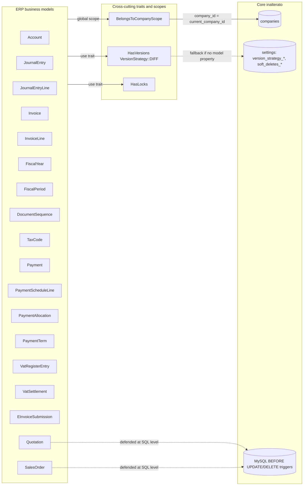

## Core functional areas

### Master data

| Entity    | Model       | Table        | Key aspects                                                      |
| --------- | ----------- | ------------ | ---------------------------------------------------------------- |
| Company   | `Company`   | `companies`  | Tenant root, functional_currency, locale                         |
| Party     | `Party`     | `parties`    | Unified customer/supplier with `is_customer`/`is_supplier` flags |
| Contact   | `Contact`   | `contacts`   | M:N with Party via `contactables` pivot                          |
| Site      | `Site`      | `sites`      | Physical location linked to `places`                             |
| Item      | `Item`      | `items`      | Product/service with SKU and costing_method                      |
| Warehouse | `Warehouse` | `warehouses` | Storage location per company                                     |

#### Commercial domain entity-relationship diagram

`Party` is the unified customer/supplier root, linked M:N to `Contact` via the `contactables` pivot. The CRM funnel is `Lead -> Opportunity -> Quotation`; an `Opportunity` becomes `won` automatically when its `Quotation` transitions to `accepted` (see `OpportunityLifecycleService` + `QuotationObserver`). `Project` aggregates work and may bind to a `Quotation`. `Task` and `TimeEntry` are typed by `Taxonomy` (Core abstract model); `TimeEntry` may reference a `QuotationItem` for billing-side valorization.

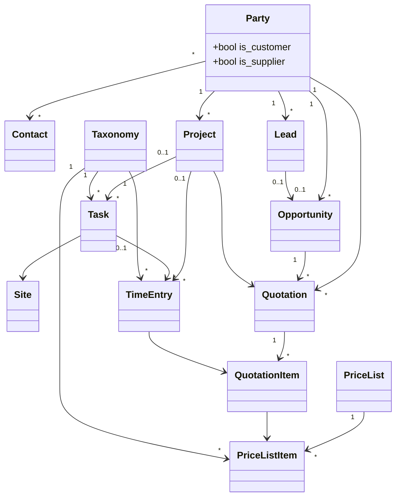

### CRM

| Entity           | Service                       | Purpose                                    |
| ---------------- | ----------------------------- | ------------------------------------------ |
| Lead             | —                             | Early-stage prospect with status lifecycle |
| Opportunity      | `OpportunityLifecycleService` | Qualified deal with pipeline stages        |
| OpportunityStage | —                             | Taxonomy-based CRM pipeline configuration  |

- `QuotationObserver` auto-marks opportunity as `won` when quotation status = accepted.

### Order-to-Cash

**Flow:** Quotation → Sales Order → Delivery Note → Invoice → Payment

| Step          | Model(s)                           | Service(s)                                                       | Key behaviors                                                                    |
| ------------- | ---------------------------------- | ---------------------------------------------------------------- | -------------------------------------------------------------------------------- |
| Quotation     | `Quotation`, `QuotationItem`       | —                                                                | HasLocks, HasValidity, lock on SO confirmation                                   |
| Sales Order   | `SalesOrder`, `SalesOrderLine`     | `SalesOrderEvasionService`, `SalesOrderAmendmentService`         | Lock-chain, qty tracking (ordered/delivered/invoiced), amendment from confirmed  |
| Delivery Note | `DeliveryNote`, `DeliveryNoteLine` | `DeliveryNoteInventoryService`, `DeliveryNoteCogsJournalService` | Stock posting (outbound), COGS journal, full rollback on unpost                  |
| Invoice       | `Invoice`, `InvoiceLine`           | `InvoicePostingService`, `InvoiceCompactionService`, `InvoiceDeliveryNoteValidationService` | Journal posting, tax snapshot, document numbering at posting, optional DDT pivot, Filament Post/Unpost |
| Payment       | `Payment`, `PaymentAllocation`     | `PaymentAllocationService`                                       | Allocate to schedule lines, status tracking                                      |

#### Invoice posting workflow (M3.5 + Filament)

Posting is **not** done by editing `posted_at` in the form. Operators use Filament **Post** / **Unpost** actions (`InvoicePostingActions`) on the invoice edit page and list table. Setting `posted_at` triggers `InvoiceObserver`, which delegates to `InvoicePostingService::post()` or `::unpost()`.

**Draft → Posted (`InvoicePostingService::post()` inside a DB transaction):**

1. Lock invoice row (`lockForUpdate`).
2. Load lines; fail if empty.
3. **Sale only:** `InvoiceDeliveryNoteValidationService::validateForPosting()` — optional pivot `invoice_line_delivery_note_line` links must reference posted DDT lines, respect delivered qty caps, and align `sales_order_line_id` when present.
4. **Purchase only:** `ThreeWayMatchService::validate()` per line — compares qty/price to linked `PurchaseOrderLine` / `GoodsReceiptLine`; persists `match_status` + `match_discrepancy` on each `InvoiceLine`. Tolerances from `ErpCompanySettings` reading `companies.settings` JSON (`erp.three_way_match.price_tolerance_percent`, `erp.three_way_match.qty_tolerance_percent`, default 0%). Throws `ValidationException` on breach unless `Invoice::$forceThreeWayMatchOnPosting` is true (Filament checkbox on Post).
5. Allocate fiscal `reference` via `DocumentNumberAllocator::next()` — `DocumentType` from `direction` + `invoice_type` (SalesInvoice, PurchaseInvoice, credit/debit note streams; `gap_allowed=false`).
6. Snapshot tax columns on lines (`tax_code`, `tax_rate`, `tax_label`).
7. Credit notes: `CreditNoteService::validateCreditNoteTotal()` + negated amounts for journal.
8. `JournalPostingService::post()` — balanced entry; invoice stored as `reference` on journal.
9. `VatRegisterService::register()`.
10. `PaymentScheduleGeneratorService::generate()` — schedule lines from `payment_term_id` or single immediate line.
11. **Sale only:** `SalesOrderEvasionService::registerInvoice()` from `sales_order_line_id` on lines.
12. Set `journal_entry_id` on invoice header.

**Posted → Draft (`::unpost()`):** reverse journal, unregister VAT, `PaymentScheduleGeneratorService::removeAll()` (blocked if schedule lines have allocations), rollback SO invoicing, clear `reference` and `journal_entry_id`.

**Filament UX rules:**

- Form shows `posted_at_display` placeholder (read-only); `posted_at` is not edited manually.
- Line repeater disabled when `journal_entry_id` is set.
- Purchase lines expose `purchase_order_line_id`, `goods_receipt_line_id`, read-only `match_status` after posting.
- Sale lines expose nested `delivery_note_line_links` repeater (DDT line + qty).
- `InvoiceResource::canDelete()` false when posted.

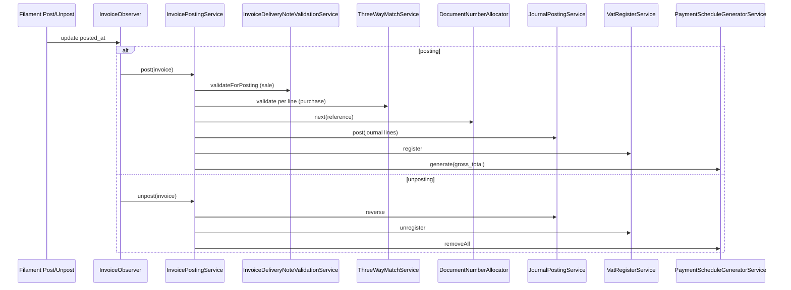

#### Sale invoice ↔ DDT linking (optional)

Pivot `erp_invoice_line_delivery_note_line` links `InvoiceLine` to `DeliveryNoteLine` with a pivot `quantity`. Linking is **optional** (lines without pivot still post). When links exist, `InvoiceDeliveryNoteValidationService` requires: parent DDT `posted_at` set; sum of pivot qty on the invoice line ≤ line `quantity`; total invoiced qty on the DDT line (other posted invoices + current) ≤ DDT line `quantity`; matching `sales_order_line_id` when both sides set. Filament: nested repeater **Delivery note lines** on sale invoice line items.

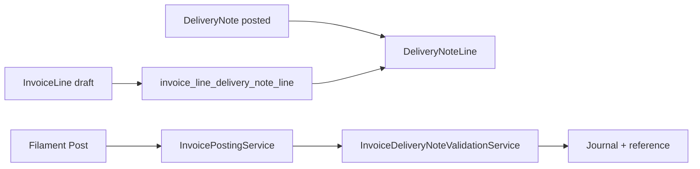

#### End-to-end document flow to Journal

The full document chain from CRM to accounting entries: a `Quotation` confirmation creates a `SalesOrder` (which locks the Quotation header). Each `DeliveryNote` posting calls `StockMovementService` to consume FIFO/avg layers and `DeliveryNoteCogsJournalService` to post a COGS `JournalEntry`. The `Invoice` posting allocates a `DocumentSequence` number (gap_allowed=false), creates the balanced `JournalEntry`, generates `PaymentScheduleLine` rows from `PaymentTerm`, and registers each line in the `VatRegisterEntry` table. Credit notes (`invoice_type=credit_note`) reuse the same posting service with sign-flipped amounts and reduce open schedule lines. The purchase cycle mirrors sales but adds `ThreeWayMatchService` validation across PO, GR, and Invoice lines.

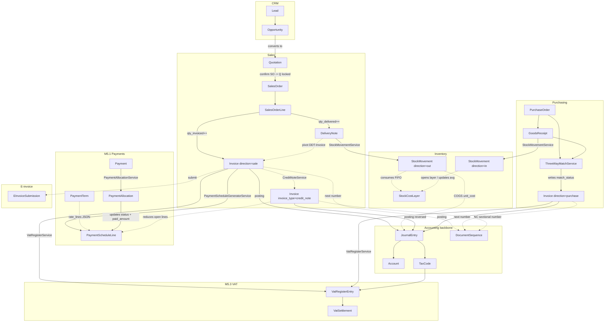

#### Lock-chain on Sales Order

The lock chain protects in-progress documents from accidental modification: when a `SalesOrder` is `confirmed`, its source `Quotation` header is locked via `HasLocks`. As soon as the first `DeliveryNote` or `Invoice` is created against a line, that line's `qty_ordered` is locked. MySQL `BEFORE UPDATE`/`BEFORE DELETE` triggers on `quotations` and `sales_orders` provide a SQL-level safety net: even a buggy service that bypassed observers would be rejected at the DB level.

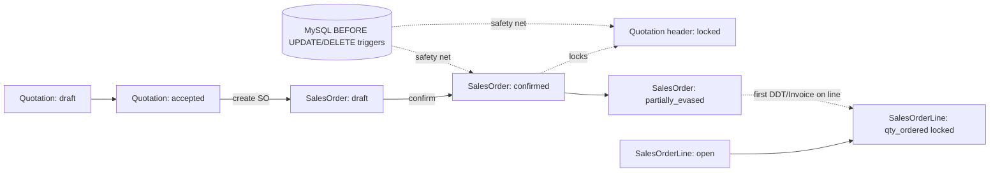

### Procure-to-Pay

**Flow:** Purchase Order → Goods Receipt → Purchase Invoice → Payment

| Step           | Model(s)                             | Service(s)             | Key behaviors                                                         |
| -------------- | ------------------------------------ | ---------------------- | --------------------------------------------------------------------- |
| Purchase Order | `PurchaseOrder`, `PurchaseOrderLine` | —                      | Document numbering, qty tracking                                      |
| Goods Receipt  | `GoodsReceipt`, `GoodsReceiptLine`   | —                      | Stock inbound posting                                                 |
| 3-Way Match    | —                                    | `ThreeWayMatchService` | Validates PO/GR/Invoice line consistency with configurable tolerances |

#### 3-Way match flow

`ThreeWayMatchService::validate()` cross-checks `PurchaseOrderLine`, `GoodsReceiptLine` and `InvoiceLine` qty/price triplets. It is invoked automatically from `InvoicePostingService::applyThreeWayMatch()` when `Invoice.direction = purchase` (before journal creation). Each `InvoiceLine` carries `purchase_order_line_id` and `goods_receipt_line_id` plus `match_status` (`MatchStatus` enum: `matched`, `tolerance`, `forced`, `unmatched`) and a `match_discrepancy` JSON column. Tolerances come from `companies.settings` via `ErpCompanySettings` (default 0%). Exceeding tolerance throws `ValidationException` unless `Invoice::$forceThreeWayMatchOnPosting` is true (set via Filament Post modal checkbox **Force three-way match** or programmatically before `posted_at` update). GR quantity comparison uses `GoodsReceiptLine.quantity`. Results are persisted on the line for audit before the invoice is considered posted.

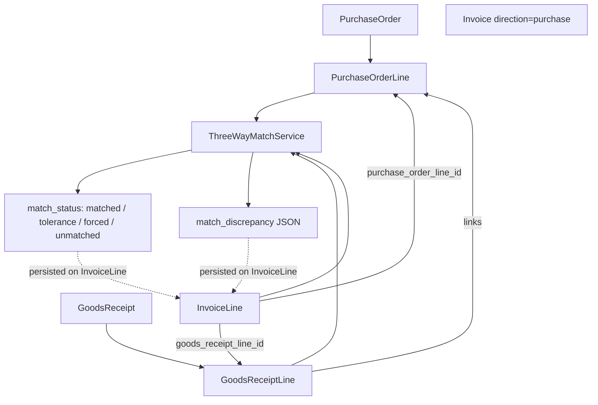

### Inventory

- `StockMovement` records every stock change with document reference.
- `stock_cost_layers` for FIFO and weighted-average costing.
- `StockMovementService` handles inbound/outbound with cost layer management.
- `StockLevel` derived from movements (not manually set).

### Accounting

| Service                      | Purpose                                                             |
| ---------------------------- | ------------------------------------------------------------------- |
| `JournalPostingService`      | Post and reverse balanced journal entries (immutable after posting) |
| `ChartOfAccountsInstaller`   | Auto-install Italian PDC on first use                               |
| `DocumentNumberAllocator`    | Pessimistic-lock numbering per company/type/year                    |
| `FiscalPeriodCloser`         | Close/reopen fiscal periods with audit                              |
| `TaxLineCalculator`          | Resolve active tax code at date, compute amounts                    |
| `TaxCodeSupersessionService` | Handle tax code versioning (new code replaces old)                  |

### Payment Schedule & Receivables

| Service                           | Purpose                                                                                      |
| --------------------------------- | -------------------------------------------------------------------------------------------- |
| `PaymentScheduleGeneratorService` | Auto-generates schedule lines at invoice posting (from PaymentTerm or single immediate line) |
| `PaymentAllocationService`        | Allocates payments to schedule lines with status updates (open→partial→paid)                 |
| `AgingReportService`              | AR/AP aging by 30/60/90/120+ day buckets grouped by party                                    |

- `PaymentTerm` defines installment rules via `rate_lines` JSON: `[{days, percent, payment_method}]`.
- Schedule lines are auto-created on invoice posting and removed on unpost (if no allocations exist).

#### Payment lifecycle

When `InvoicePostingService::post()` runs, it reads the invoice's `payment_term_id` and delegates to `PaymentScheduleGeneratorService`, which expands the term's `rate_lines` JSON into one `PaymentScheduleLine` per installment (initial status `open`). Each `Payment` (direction `inbound` or `outbound`) is allocated to one or more schedule lines through the `PaymentAllocation` pivot via `PaymentAllocationService::allocate()`; allocations update `paid_amount_doc` and the line status (`open -> partial -> paid`). `AgingReportService` aggregates open lines by party into 30/60/90/120+ day buckets.

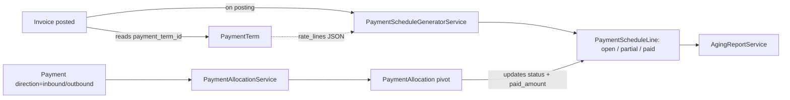

### Credit & Debit Notes

| Service             | Purpose                                                                                        |
| ------------------- | ---------------------------------------------------------------------------------------------- |
| `CreditNoteService` | Creates credit note from posted invoice, copies lines, validates total doesn't exceed original |

- `InvoiceType` enum: `invoice`, `credit_note`, `debit_note`.
- Credit notes use inverted journal entries (debits↔credits flipped).
- Separate document numbering: `SalesCreditNote`, `PurchaseCreditNote`, `SalesDebitNote`, `PurchaseDebitNote`.
- CN total cannot exceed remaining creditable amount of original invoice.

#### Credit note flow

`CreditNoteService::createFromInvoice()` clones the original `Invoice` into a new one with `invoice_type=credit_note` and `credited_invoice_id` referencing the source. Lines are duplicated and amounts validated to never exceed the residual credit-able amount. On posting, `InvoicePostingService::post()` produces a sign-flipped `JournalEntry` (debits and credits swapped), allocates a number from a dedicated sectional (`DocumentType::SalesCreditNote` / `PurchaseCreditNote`), and reduces or cancels open `PaymentScheduleLine` entries linked to the original invoice.

Credit/debit notes are fiscal corrections. Their natural price source is the original invoice line, not the sales or purchase order line. Order lines can explain logistics and fulfilment; invoice lines explain fiscal value. Return-line `unit_price` exists only as an explicit manual override.

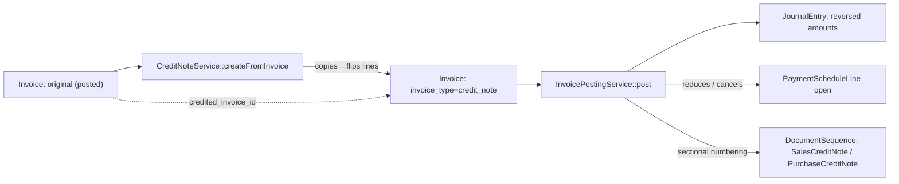

### Returns Management

| Service                         | Purpose                                                                                                      |
| ------------------------------- | ------------------------------------------------------------------------------------------------------------ |
| `ReturnOrderService`            | Orchestrates customer return approval, completion, cancellation, manual credit-note follow-up, and optional auto credit-note creation on completion |
| `CustomerReturnReceiptService`  | Generates/links inbound DDTs for customer-return physical receipts and records returned quantities            |
| `SupplierReturnService`         | Orchestrates supplier return approval, completion, cancellation, manual debit-note follow-up, and optional auto debit-note creation on completion |
| `SupplierReturnShipmentService` | Generates/links outbound DDTs for supplier-return physical shipments and records returned quantities          |

- Customer returns use `ReturnOrder` / `ReturnOrderLine`.
- Supplier returns use `SupplierReturn` / `SupplierReturnLine`.
- Physical customer returns generate or link inbound `DeliveryNote` records.
- Physical supplier returns generate or link outbound `DeliveryNote` records.
- Delivery-note lines remain quantity/source-link only; commercial prices and inventory costs stay out of bolle.
- Customer return completion increments `qty_returned` on linked `InvoiceLine` and `SalesOrderLine` records.
- Supplier return completion increments `qty_returned` on linked `PurchaseOrderLine` and `GoodsReceiptLine` records.
- Customer return credit notes use `ReturnOrderLine.invoice_line_id` and default to the source sales `InvoiceLine.unit_price`; `ReturnOrderLine.unit_price` is an optional manual credit-note override.
- Supplier return debit notes use `SupplierReturnLine.invoice_line_id` and default to the source purchase `InvoiceLine.unit_price`; `purchase_order_line_id` and `goods_receipt_line_id` remain logistics lineage only.
- Supplier return debit-note creation is blocked without a source purchase invoice line. A physical supplier return can be completed from PO/GR before invoice correction, but fiscal correction must wait for the purchase invoice line.
- Credit/debit-note creation is manual by default. If `erp.returns.auto_create_notes_on_complete` is true for the company, `complete()` creates the credit/debit note draft automatically using the same invoice-line contracts. Validation failures abort the completion transaction.

#### Return flow

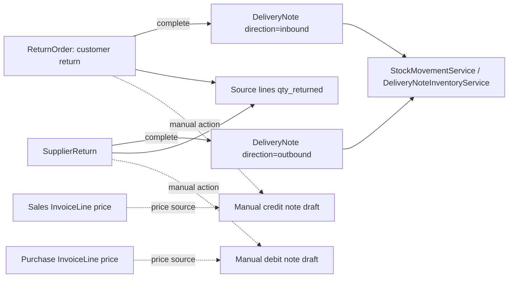

#### Return fiscal-source rules

| Flow | Logistics source | Fiscal source | Price default |
| ---- | ---------------- | ------------- | ------------- |
| Customer return credit note | DDT / sales order / returned stock | Source sales `InvoiceLine` | Sales invoice line `unit_price` |
| Supplier return debit note | Purchase order / goods receipt / outbound DDT | Source purchase `InvoiceLine` | Purchase invoice line `unit_price` |

Do not add prices to DDT/bolle. DDTs prove movement of goods; invoices and invoice lines prove fiscal value.

### VAT Registers & Settlement (Italian Compliance)

| Service                | Purpose                                                                                                  |
| ---------------------- | -------------------------------------------------------------------------------------------------------- |
| `VatRegisterService`   | Auto-registers invoices in VAT register at posting (one entry per tax code, progressive protocol number) |
| `VatSettlementService` | Computes periodic VAT settlement (sales VAT − purchase VAT − previous credit)                            |

- `VatRegisterEntry`: protocol_number is sequential per company/register_type/fiscal_year.
- `VatSettlement`: draft → confirmed lifecycle with carry-forward of credit.
- Credit notes create negative register entries.

#### VAT registers and settlement flow

At invoice posting, `VatRegisterService::register()` writes one `VatRegisterEntry` per `tax_code` on the invoice, assigning a `protocol_number` progressive per `(company_id, register_type, fiscal_year)`. The entries are scoped by `register_type` (`sales` / `purchases`). At period close, `VatSettlementService::compute()` aggregates the period's entries: `vat_sales - vat_purchases - previous_credit = settlement_amount`. The resulting `VatSettlement` (status `draft -> confirmed`) carries any negative balance forward as `previous_credit` to the next period.

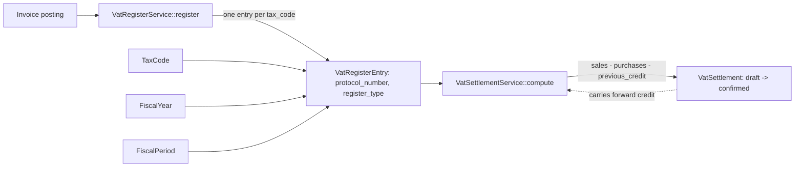

### Financial Statements

| Service                  | Purpose                                          |
| ------------------------ | ------------------------------------------------ |
| `TrialBalanceService`    | Debit/credit balance per account at a given date |
| `BalanceSheetService`    | Assets = Liabilities + Equity + Net Income       |
| `IncomeStatementService` | Revenue − Expenses for a date range              |

- Filament pages with Blade templates for tabular display.
- All data derived from posted journal entries (no separate snapshot tables).

#### Financial reports flow

All three report services read posted `JournalEntryLine` records (filtered by `posted_at IS NOT NULL`) without any separate snapshot table: the journal is the single source of truth. `TrialBalanceService` aggregates by account producing debit/credit balances at a point-in-time. `BalanceSheetService` slices the trial balance by account `kind` (asset/liability/equity) and includes net income from the income statement. `IncomeStatementService` aggregates revenue/expense accounts over a `FiscalPeriod` range. Filament Blade pages render the structured DTO arrays returned by each service.

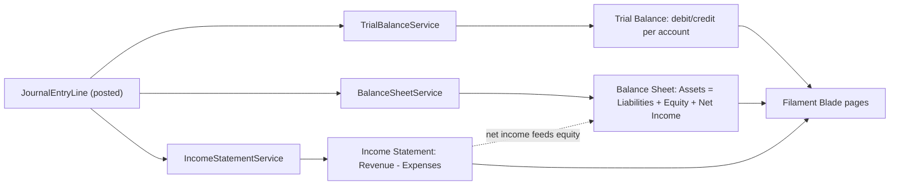

### E-Invoice Interface

- `EInvoiceProvider` contract: `prepare()`, `submit()`, `validateXml()`, `remoteStatus()`.
- `EInvoiceSubmission` model tracks submission lifecycle.
- `StubEInvoiceProvider` is bound by default and produces deterministic local responses.
- `FatturaPaXmlBuilder` builds ordinary FPR12 XML from ERP sale invoice data through `FatturaPaAnagraphicMapper`.
- Official FPR12 v1.2.3 XSD resources are vendored under `resources/xsd/fatturapa/` with local XMLDSIG dependency for offline validation.
- `FatturaPaEInvoiceProvider` is selected with `erp.einvoice.driver = fatturapa`; it generates and validates XML locally but does not contact SDI.
- `EInvoiceSubmissionService` persists submit attempts and refreshes remote status.
- Invoice edit actions can submit posted sale invoices and refresh submitted rows.
- Current runtime is still local by default; real provider delivery is not implemented yet.

#### Phase 2C — FatturaPA / SDI production readiness

Phase 2C is the active e-invoice implementation slice. It extends the existing neutral provider contract instead of replacing it:

1. **Done:** Add the FatturaPA / SDI fiscal fields needed on company, party, and invoice records, and block sale e-invoice submit when mandatory readiness data is missing.
2. **Done:** Map `Company`, `Party`, and `Invoice` into an extended neutral payload with FatturaPA-shaped anagraphic data.
3. **Done:** Build FatturaPA ordinary FPR12 XML and validate it through vendored official XSD resources.
4. **Next:** Add a production-oriented provider adapter, starting with Aruba behind Laravel config and HTTP fakes in tests.
5. Gate tax-code, company-switch, sequence, and e-invoice admin actions through explicit permissions.

### Lock & Safety Mechanisms

- Application-level: `HasLocks` trait with observers that apply locks on business events.
- Database-level: MySQL `BEFORE UPDATE`/`BEFORE DELETE` triggers on `quotations` and `sales_orders` as safety net.
- Observer and trigger coexist: observer applies the lock, trigger defends it.

## Key enums

| Enum                    | Values                                                                                                                                                                    | Used by                   |
| ----------------------- | ------------------------------------------------------------------------------------------------------------------------------------------------------------------------- | ------------------------- |
| `InvoiceDirection`      | sale, purchase                                                                                                                                                            | Invoice                   |
| `InvoiceType`           | invoice, credit_note, debit_note                                                                                                                                          | Invoice                   |
| `DocumentType`          | quotation, sales_order, purchase_order, sales_invoice, purchase_invoice, sales_credit_note, purchase_credit_note, sales_debit_note, purchase_debit_note, internal_journal | DocumentSequence          |
| `PaymentDirection`      | inbound, outbound                                                                                                                                                         | Payment                   |
| `PaymentScheduleStatus` | open, partial, paid, cancelled                                                                                                                                            | PaymentScheduleLine       |
| `MatchStatus`           | matched, tolerance, forced, unmatched                                                                                                                                     | InvoiceLine (3-way match) |
| `ReturnStatus`          | draft, approved, processed, cancelled                                                                                                                                     | ReturnOrder, SupplierReturn |
| `DeliveryNoteDirection` | outbound, inbound                                                                                                                                                         | DeliveryNote              |
| `VatRegisterType`       | sales, purchases                                                                                                                                                          | VatRegisterEntry          |
| `VatSettlementStatus`   | draft, confirmed                                                                                                                                                          | VatSettlement             |
| `QuoteStatus`           | draft, sent, accepted, rejected, expired                                                                                                                                  | Quotation                 |
| `SalesOrderStatus`      | draft, confirmed, partially_evased, fully_evased, cancelled                                                                                                               | SalesOrder                |
| `LeadStatus`            | new, contacted, qualified, converted, lost                                                                                                                                | Lead                      |
| `OpportunityStatus`     | open, won, lost                                                                                                                                                           | Opportunity               |

## Filament admin resources

### Accounting group

Company, Account, JournalEntry (view page), FiscalYear, FiscalPeriod, DocumentSequence, TaxCode

### Commercial group

Party, Contact, Quotation, Project, Lead, Opportunity, SalesOrder, DeliveryNote, Invoice (Post/Unpost header + table actions), PurchaseOrder, GoodsReceipt, ReturnOrder, SupplierReturn

### Financial group

PaymentTerm, Payment, PaymentRun, BankAccount, BankStatement, VatRegister (read-only), VatSettlement (read-only)

### Report pages

Trial Balance, Balance Sheet, Income Statement

## Current implementation state

| Area | Status | Notes |
| ---- | ------ | ----- |
| Accounting backbone | Implemented | Companies, accounts, journals, fiscal years/periods, document sequences, posting/reversal services. |
| Sales and inventory | Implemented | CRM, quotations, sales orders, DDTs, stock movements, cost layers, COGS journals, invoice posting. |
| Purchasing | Implemented | Purchase orders, goods receipts, purchase invoices, and three-way match. |
| Payments and VAT | Implemented + payment execution v1 | Payment terms, payment schedules, allocations, aging, VAT register, VAT settlement, supplier payment runs, and SEPA `pain.001` export. |
| Returns | Implemented v1 + optional fiscal automation | Physical customer/supplier returns with DDT integration and returned-quantity tracking. Fiscal follow-up is manual by default; company setting `erp.returns.auto_create_notes_on_complete` can create NC/ND drafts during completion. |
| Return fiscal pricing | Implemented | Customer credits default to sales invoice lines; supplier debits default to purchase invoice lines; order prices are not fiscal default prices. |
| Pricing | Implemented v1 + UI | Price lists, price list items, party price rules, resolver, Party relation manager, PriceList resource. |
| Policies and domain actions | Implemented Phase 2A + 2B | State-aware `ERPModelPolicy`, seeded domain permissions, invoice/fiscal/DDT/journal/SO actions, quotation unlock, document sequence reset. |
| Banking | Implemented v1 + differences + bank formats | CSV, CAMT.053, and minimal MT940 import, suggestions, manual reconciliation, match-with-difference UI, and accounting journals for bank fees/rounding/write-offs. Outbound supplier payment-file export is handled by PaymentRun. |
| E-invoice | Stub implemented; FatturaPA local XML active | Provider contract, stub provider, submission persistence, submit/refresh actions, FatturaPA / SDI schema data, mapping, and FPR12 XML/XSD validation. Provider integration and extended permissions remain Phase 2C follow-up. |
| Reporting | Implemented v1 + CSV export | Trial balance, balance sheet, and income statement have Filament CSV exports. Sales pipeline has won-date filters, KPIs, and CSV export. Stock valuation has warehouse filter, KPIs, and CSV export. |

## Known gaps, limitations, and correction notes

These items are intentional current-state truth for RAG retrieval. Do not answer as if they are already implemented.

| Area | Current truth | Do not assume |
| ---- | ------------- | ------------- |
| FatturaPA / SDI | The neutral workflow, stub provider, readiness fields, submit-time readiness validation, FatturaPA-shaped mapper, FPR12 XML builder, vendored official XSD, and local `fatturapa` driver validation exist. | Do not claim real SDI delivery, Aruba production submission, advanced SDI statuses, legal retention, or complete coverage of every FatturaPA/SDI business rule. |
| Fiscal anagraphic data | Company, party, and invoice records now store the minimum FatturaPA/SDI readiness fields. `EInvoiceSubmissionService` rejects sale submit when mandatory readiness data is missing. `FatturaPaAnagraphicMapper` maps those fields into a neutral payload used by the XML builder. | Do not claim every Italian fiscal edge case is mapped; unsupported details still require future fields/mapping. |
| Payment runs | ERP exports SEPA SCT `pain.001` files with checksum/audit metadata. | Do not claim direct bank API submission, CBI, Ri.Ba, SDD, or proprietary Italian bank tracks. |
| Bank statement import | CSV, CAMT.053, and a minimal MT940 transaction subset are supported. | Do not claim full MT940 coverage, bank API sync, or automatic reconciliation without operator confirmation. |
| Domain HTTP/API | Filament actions call services, but generic internal domain-action routes and opt-in external API governance are Phase 3 work. | Do not expose domain mutations through ad hoc routes before the Phase 3 Core exposure model exists. |
| Processed returns | Draft/approved returns can be cancelled; processed returns do not yet have a safe revert/reverse flow. | Do not reverse stock/DDT/NC-ND effects manually or by deleting processed records. |
| Return fiscal pricing | Credit/debit notes from returns default to source invoice-line prices; return-line `unit_price` is only an explicit override. | Do not price fiscal corrections from orders, goods receipts, DDT lines, or current price lists. |
| Delivery notes | DDT/bolle lines are quantity and source-link documents. | Do not add prices or costs to DDT lines; stock cost lives in stock movements/cost layers. |
| Reporting/export | Financial and operational reports are live-query reports with CSV export. | Do not claim PDF export, scheduled report snapshots, or immutable report archives. |
| Multi-currency | Schema and converter foundation exist; the converter is effectively no-op until real FX work lands. | Do not claim FX rates, realized/unrealized exchange differences, or revaluation journals. |
| Money model | Persisted money, prices, costs, and quantities use decimals; selected services use decimal math helpers. | Do not claim a full domain-wide Money value object is implemented. |
| Analytic accounting | Project/site-style analytic references are limited and not a full journal-line dimension model. | Do not claim cost centers, profit centers, or arbitrary analytic dimensions. |
| Pricing | Price lists, price list items, party rules, and taxonomy/activity-based pricing are implemented. | Do not claim direct item-specific list pricing beyond the current schema. |
| Locks and DB triggers | Application locks are the cross-database source of truth. MySQL triggers exist as an extra safety net for selected lock chains. | Do not rely on DB triggers as portable enforcement across PostgreSQL, Oracle, or SQLite. |
| Permissions | Core CRUD permissions plus seeded domain abilities are used. A model without explicit `$connection` correctly uses the default connection. | Do not treat the default permission connection as a bug; central permission-name helper work is only needed if explicit model connections become relevant. |
| Concurrency proof | Document numbering uses pessimistic locks and focused tests exist. A broad 50-worker stress suite remains backlog. | Do not use stress-test coverage claims unless the dedicated concurrency suite has been run. |
| Legacy/vertical work | ETL, ICS/calendar export, Gantt planning, mobile API, and Tricount refactor are future phases. MES is not part of the current ERP scope. | Do not mix MES assumptions or vertical scheduling behavior into ERP core decisions. |

## Typical developer questions (FAQ for RAG)

- **Which service posts inventory when a delivery note is confirmed?**
→ `DeliveryNoteInventoryService` creates outbound stock movements and updates SO qty_delivered.
- **How does invoice posting work?**
→ Filament **Post** sets `posted_at`; `InvoiceObserver` calls `InvoicePostingService::post()` in a DB transaction: DDT validation (sale), three-way match (purchase), document number, tax snapshot, journal, VAT register, payment schedule, SO qty_invoiced. **Unpost** reverses the chain (schedule removal blocked if allocations exist).
- **How do I post an invoice from the UI?**
→ Use **Post** on the invoice edit page or list (`InvoicePostingActions`). Do not set `posted_at` manually in the form.
- **How does optional Invoice ↔ DDT linking work?**
→ Pivot `erp_invoice_line_delivery_note_line` (qty per link). Optional at posting; `InvoiceDeliveryNoteValidationService` enforces posted DDT, qty caps, and SO line consistency when links exist.
- **How do purchase receipts affect stock and accounting?**
→ GoodsReceipt posting creates inbound `StockMovement` entries, updates PO line quantities, and creates cost layers.
- **How does the 3-way match work?**
→ On purchase invoice posting, `InvoicePostingService` calls `ThreeWayMatchService::validate()` per line. Tolerances: `ErpCompanySettings` on `companies.settings`. Exceeding tolerance blocks posting unless **Force three-way match** is checked (sets `forceThreeWayMatchOnPosting`). Status stored in `match_status` / `match_discrepancy`.
- **How are credit notes handled?**
→ `CreditNoteService::createFromInvoice()` copies lines from original. On posting, `InvoicePostingService` negates amounts for inverted journal entries. Separate numbering via `DocumentType::SalesCreditNote`/`PurchaseCreditNote`.
- **How are supplier payment files generated?**
→ Create a `PaymentRun` from open/partial purchase invoice schedule lines. `PaymentRunBuilderService` locks the schedule lines, validates supplier bank coordinates, and stores beneficiary snapshots on `PaymentRunLine`. After approval, `SepaPain001Exporter` generates SEPA SCT `pain.001` XML and marks the run exported with checksum metadata. No direct bank/API submission is performed.
- **How are bank reconciliation differences handled?**
→ `BankReconciliationService::matchPaymentWithDifference()` matches the statement line to the payment and calls `BankDifferenceJournalService`. The service posts a balanced journal on the bank cash account (`erp_role=bank_cash`) and the selected difference account, then stores the journal id on `BankStatementLine.difference_journal_entry_id`.
- **Which bank statement import formats are supported?**
→ CSV remains supported through `BankStatementCsvImporter`. CAMT.053 XML and a minimal MT940 `:61:` / `:86:` transaction subset are parsed through `BankStatementImportService`, `Camt053Parser`, and `Mt940Parser`; imported rows are persisted as `BankStatementLine` with the original parser metadata in `raw_payload`.
- **How do customer and supplier returns work?**
→ Customer returns are `ReturnOrder` documents that complete through inbound DDTs; supplier returns are `SupplierReturn` documents that complete through outbound DDTs. Completion records stock movement through the DDT inventory path and updates `qty_returned` on linked source lines. Credit/debit notes are manual by default, or automatic during completion when `erp.returns.auto_create_notes_on_complete` is true. Customer credits price from sales invoice lines; supplier debits price from purchase invoice lines. Orders/GR/DDT are logistics lineage, not fiscal price sources.
- **How does e-invoice submission work?**
→ `EInvoiceProvider` resolves to `StubEInvoiceProvider` by default. `EInvoiceSubmissionService::submit()` accepts only posted sale invoices, stores an `EInvoiceSubmission`, and blocks duplicate active submissions. With `erp.einvoice.driver = fatturapa`, the provider builds and XSD-validates FPR12 XML before persisting the local submission. `refresh()` maps provider statuses back to `submitted`, `accepted`, or `rejected`.
- **What is Phase 2C adding to e-invoice?**
→ Phase 2C turns the current stub workflow into the Italian production path. SDI/FatturaPA fields, `FatturaPaAnagraphicMapper`, FPR12 XML building, and XSD validation are implemented; provider adapter and permissions for high-risk fiscal actions remain next.
- **How do payment schedules work?**
→ At invoice posting, `PaymentScheduleGeneratorService::generate()` creates schedule lines based on `PaymentTerm` rate_lines (or single immediate line if no term). Payments are allocated via `PaymentAllocationService`.
- **Where is VAT register logic?**
→ `VatRegisterService::register()` is called by `InvoicePostingService` after journal creation. Creates one `VatRegisterEntry` per tax code on the invoice, with sequential protocol numbers. `VatSettlementService::compute()` calculates periodic settlement.
- **How do financial reports work?**
→ `TrialBalanceService`, `BalanceSheetService`, `IncomeStatementService` query posted `JournalEntryLine` records aggregated by account. No separate snapshot tables — always live from journal. `FinancialReportCsvExporter` exports trial balance, balance sheet, and income statement; the related Filament pages expose **Export CSV** actions.
- **How do operational dashboards work?**
→ `SalesPipelineService` summarizes opportunities by status and computes won-period KPIs from `won_from` / `won_to` filters. `StockValuationService` summarizes current `StockLevel` rows and supports an optional `warehouse_id` filter. `OperationalReportCsvExporter` exports both dashboards to CSV from their Filament pages.
- **What is the Party entity?**
→ `Party` (table: `parties`) is the unified customer/supplier entity. Boolean flags `is_customer`/`is_supplier` distinguish roles. Scopes: `scopeCustomers()`, `scopeSuppliers()`. Sales-side models validate party is_customer, purchase-side validates is_supplier.
- **How does document numbering work?**
→ `DocumentNumberAllocator::next()` with pessimistic lock per company/DocumentType/fiscal_year. `defaultGapAllowed()` on DocumentType controls whether rollback gaps are acceptable (true for quotations/orders, false for fiscal documents like invoices).
- **How does the lock-chain work?**
→ Confirming a SO locks the linked Quotation. Starting evasion locks SO line qty_ordered. DB triggers (BEFORE UPDATE/DELETE on quotations, sales_orders) provide a safety net preventing modification of locked records at SQL level.
- **What is the safe extension pattern for new ERP document states?**
→ Create a new service in `app/Services/`, wire it via constructor injection, use `DB::transaction()` + `lockForUpdate()` for concurrency, emit journal entries via `JournalPostingService`, update document status in the same transaction.

## Dependencies

- Strong dependency on `Core` lifecycle infrastructure (users, locks, settings, versioning, MigrateUtils).
- Optional `AI` module support for assistant/search scenarios.

## Risks and controls

- Inventory/accounting divergence if posting logic is bypassed (mitigated by service-only posting).
- Fiscal period closure without reconciliation can lock incorrect balances (mitigated by `FiscalPeriodCloser` audit).
- Tax behavior must remain parameterized and version-aware for regulatory changes (mitigated by `TaxCode` supersession).
- VAT register protocol numbers must be sequential — unpost creates gaps (acceptable per Italian law for cancelled invoices).
